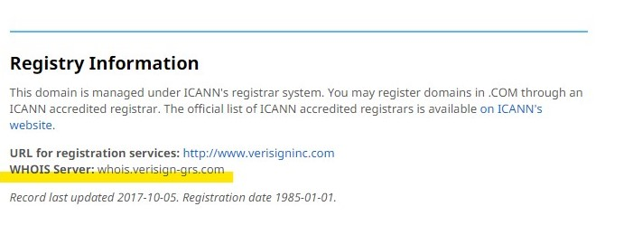

# 域名扫描工具

## 特别感谢

本项目在“[DomainMegaBot](https://github.com/Har-Kuun/DomainMegaBot)”和“[DomainScan](https://github.com/luodaoyi/DomainScan)”两个仓库的基础上进行了修改和拓展，感谢两位大佬。

单词字典和心形代码下载于网络，感谢网络

本项目Github地址：[https://github.com/wenoif/DomainTools](https://github.com/wenoif/DomainTools)

## 功能介绍

+ 功能：
  
+ 扫描200多个顶级域名有没有被注册
  
+ 语言：
  + 扫描工具：python 3
  + 字典生成：C语言

+ 方式：
  + 指定”域名“检测”所有后缀“能否注册
  + 指定”字典“检测”所有后缀“能否注册
  + 指定“后缀”和“字典”检测能否注册
  
+ 附件：
  + 附带20个字典库

  + 附带字典生成程序

## 文件说明

+ dic字典库

  > 1-0+2-6+3-6pl4.txt:4位以内带符号的所有全排
  >
  > 1-0pl3/4.txt：10个数字全排带-符号3/4位
  >
  > 2-6pl3/4.txt：26个字母全排带-符号3/4位
  >
  > 3-6pl3/4.txt：126个字母+10个数字全排带-符号3/4位
  >
  > 10+26+36pl4.txt:4位以内的“数字+字母”所有全排
  >
  > 10pl1+2+3+4+5.txt：10个数字全排1-5位
  >
  > 26pl1.txt----26pl4.txt：26个字母全排1-4位
  >
  > 26pl1+2+3+4.txt：26个字母全排1-4位
  >
  > 36pl2+3.txt：36个字母+10个数字全排2-3位
  >
  > 36pl2.txt----36pl4.txt：36个字母+10个数字全排2-4位
  >
  > all1+2+3.txt：所有的1位2位3位组合
  >
  > words_and-:46W个英文单词(含连字符)
  >
  > words_no-:37W个英文单词(不含连字符)

+ data数据库

  > 进行扫描后的数据

+ **CreateDictionary.c** 字典生成C语言程序，支持生成以下20种字典

  > 1.10个数字全排带(-)符号3位;
  >
  > 2.10个数字全排带(-)符号4位;
  >
  > 3.26个字母全排带-符号3位;
  >
  > 4.26个字母全排带-符号4位;
  >
  > 5.26个字母+10个数字全排带-符号3位;
  >
  > 6.26个字母+10个数字全排带-符号4位;
  >
  > 7.10个数字全排1位;
  >
  > 8.10个数字全排2位;
  >
  > 9.10个数字全排3位;
  >
  > 10.10个数字全排4位;
  >
  > 11.10个数字全排5位;
  >
  > 12.26个字母全排1位;
  >
  > 13.26个字母全排2位;
  >
  > 14.26个字母全排3位;
  >
  > 15.26个字母全排4位;
  >
  > 16.26个字母全排5位;
  >
  > 17.26个字母+10个数字全排1位;
  >
  > 18.26个字母+10个数字全排1位;
  >
  > 19.26个字母+10个数字全排1位;
  >
  > 20.26个字母+10个数字全排5位;

+ **demo.txt**  测试字典

+ **domain_tool.py**  扫描工具

+ **README.MD** 说明文件

+ **top_level_domain_name_suffix** 顶级域名后缀数据

+ **success.txt** 保存扫描成功没被注册的域名

+ **failure.txt** 保存扫描失败的域名

##  脚本使用

1. `python3 domain_tool.py`
2. 选择相应的功能
3. 如果使用字典库，需要将想要使用的字典复制到扫描工具的同级目录下
4. 用户可以在**demo.txt** 修改自己想要扫描的域名前缀
5. 用户可以在扫描工具的同级目录下新建字典，字典不需要带后缀(.com  .xyz等)

## 使用截图

+ 选择功能

+ 选项1

+ 选项2

+ 选项3

+ 扫描到没有注册的域名

+ 生成字典

## 增加域名

在“top_level_domain_name_suffix”文件中存储着顶级域名后缀数据，

数据格式为：`域名后缀=whois服务器=为空的返回信息=`

例如： `com=whois.verisign-grs.com=No match for=`

若增加域名，可以在[IANA](www.iana.org)获得域名whois服务器信息。

例如获得com的whois服务器信息只需要访问`https://www.iana.org/domains/root/db/com.html`，

在页面下方得到whois服务器。

获得为空时候的返回数据，大部分是`No match for`，获得方法是进行访问一个未注册的域名获得返回信息（python3函数whois_query），在返回信息中提取。

## 到底啦

：）技术能力有限，功能尚不完善，代码不够完美，还请多多包涵。

